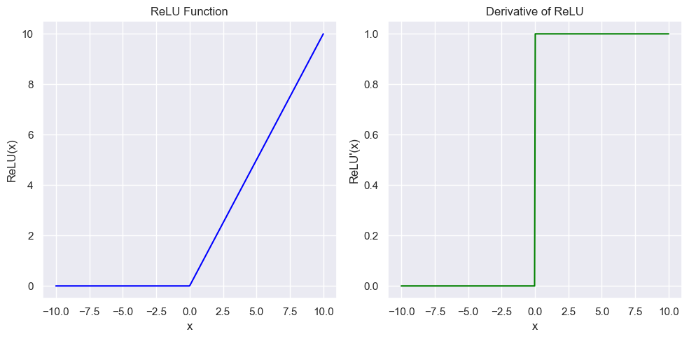
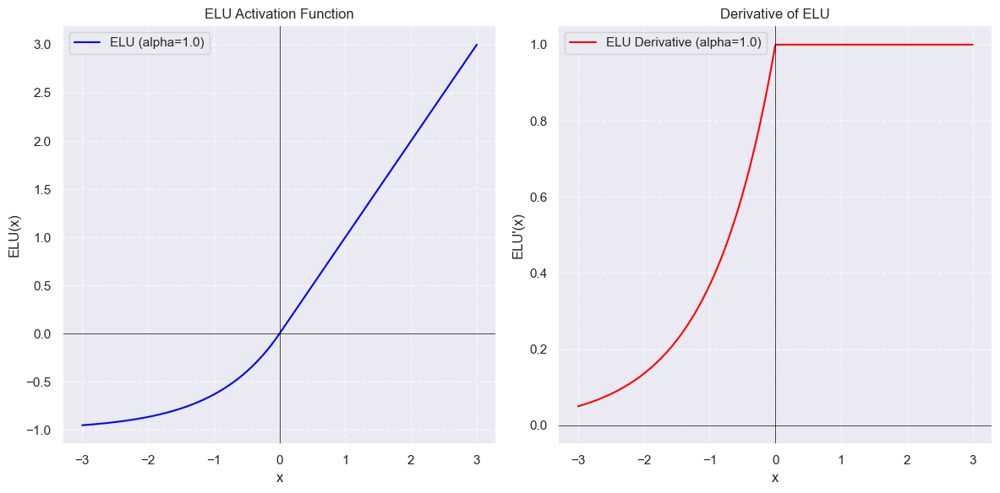
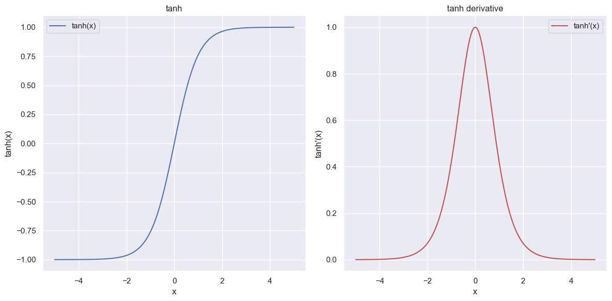
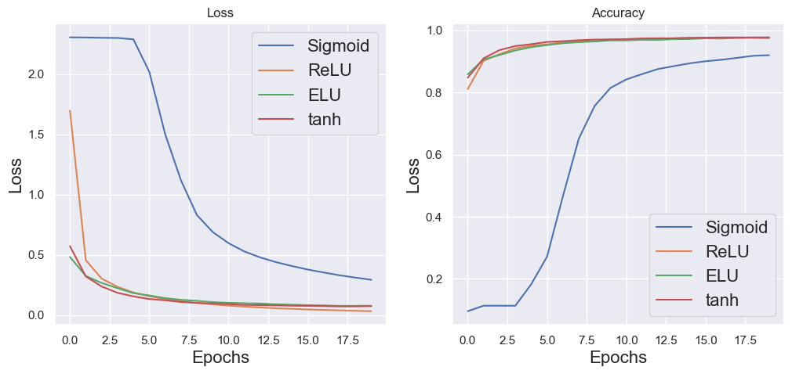
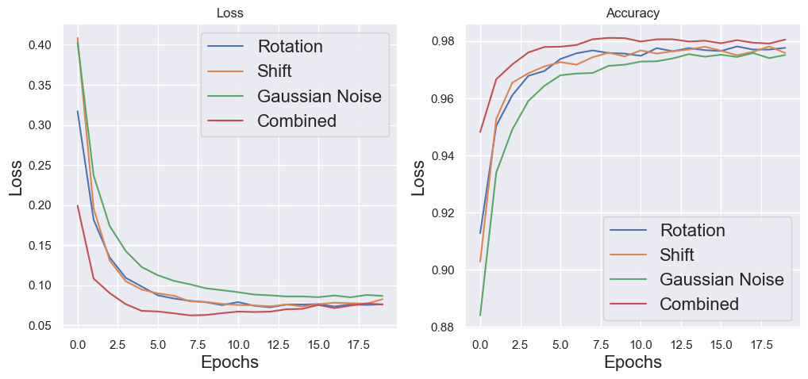

# HomeWork 2 "Neural Networks" Course

The goal is to learn ***pytorch*** basics while MNIST processing. 
  Couple of activations were tested (*comparing to sigmoid*):  

## ReLU (Rectified Linear Unit)

### $ReLU(z) = max(0, z)$ 

## ELU (Exponential Linear Unit)

$$
\text{ELU}(x) =
\begin{cases}
x & \text{if } x \geq 0 \\
\alpha (\exp(x) - 1) & \text{if } x < 0
\end{cases}
$$

$\alpha$ - hyperparameter which controls value for negative inputs.

## tanh (Hyperbolic tangent)

### $tanh(z) = \frac{2}{1 + e^{-2z}} - 1 = \frac{e^{z} - e^{-z}}{e^{z} + e^{-z}} = \frac{e^{2z} - 1}{e^{2z} + 1}$ - hyperbolic tangent
### $\frac{\partial tanh(z)}{\partial z} = 1 - tanh^{2}(z)$ - derivative

## Activations results

## Augmentation approaches

### 1. Image rotations
### 2. Image shifts
### 3. Gaussian Noise apply
### 4. Combination of approaches

## Augmentation results

